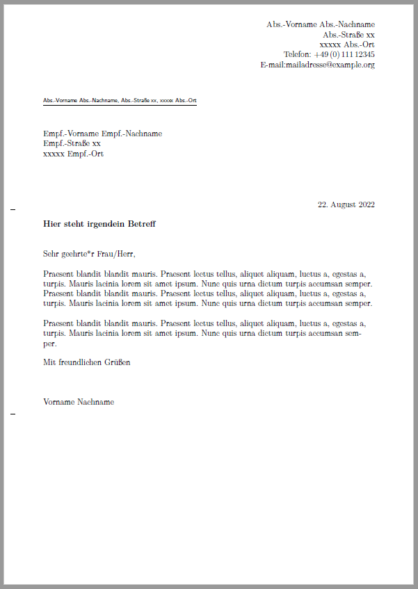
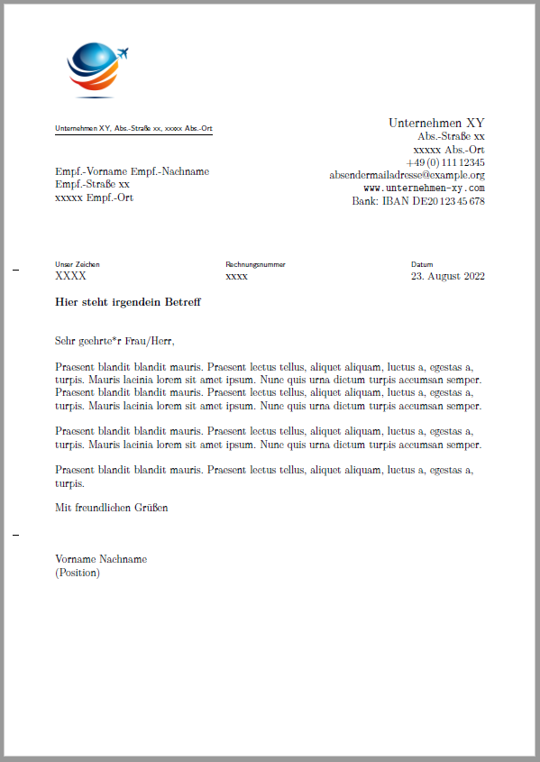

Ein kleines Repository, das die Verwendung von KOMA-Script scrlttr2 zur Erstellung von deutschen Geschäftsbriefen in LaTeX demonstriert.

Neben dem Brief-Template(Musterbrief.tex) stehen zwei verschiedene Letter Class Options bereit:  
schlicht.lco erzeugt ein einfaches an DIN 5008 orientiertes Brieflayout. 
.... demonstriert, wie für ein etwas professionelleres Layout ein Logo\* eingefügt und an üblicher Stelle im Briefkopf plaziert werden kann.
Wie im Deutschen üblich, sind Brieftext und Signatur in beiden Varianten nicht eingerückt.

Die gewünschte .lco kann einfach in Musterbrief.tex aktiviert werden, und die meisten Befehle sind kommentiert, um eine einfache Anpassung zu ermöglichen.

\* Image by [Greg Stevenson](https://pixabay.com/users/photos_greg-21117672/) from Pixabay

### Beispieloutput schlichte Variante

### Beispieloutput Logo-Variante

### Beispieloutput Logo-Variante mit Logo links

(hierfür einfach in logo.lco \raggedleft in Zeile 56 auskommentieren)

