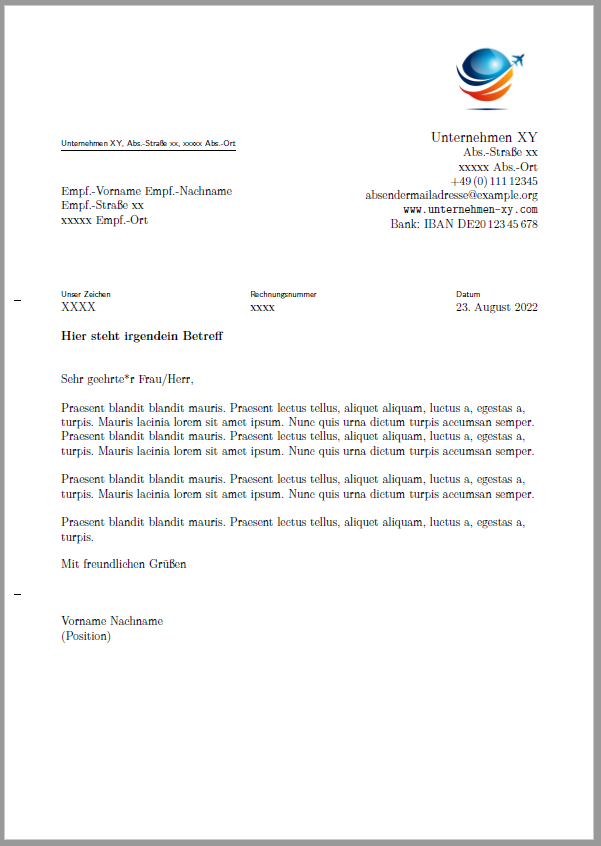

Ein kleines Repository, das die Verwendung von KOMA-Script scrlttr2 zur Erstellung von deutschen Geschäftsbriefen in LaTeX demonstriert.

Neben dem Brief-Template(Musterbrief.tex) stehen zwei verschiedene Letter Class Options bereit:  
schlicht.lco erzeugt ein einfaches an DIN 5008 orientiertes Brieflayout. 
logo.lco demonstriert, wie für ein etwas professionelleres Layout ein Logo_\*_ eingefügt und an üblicher Stelle im Briefkopf plaziert werden kann.
Wie im Deutschen üblich, sind Brieftext und Signatur in beiden Varianten nicht eingerückt.

Die meisten Befehle sind kommentiert, um eine einfache Anpassung zu ermöglichen.

_\*_ Image by [Greg Stevenson](https://pixabay.com/users/photos_greg-21117672/) from Pixabay

### Verwendung

Einfach die gewünschte Letter Class Option (.lco) in Musterbrief.tex aktivieren und die andere auskommentieren. 

### Beispieloutput 

#### schlichte Variante

#### Logo rechts

#### Logo-Variante mit Logo links

(hierfür einfach in logo.lco \raggedleft in Zeile 56 auskommentieren)

